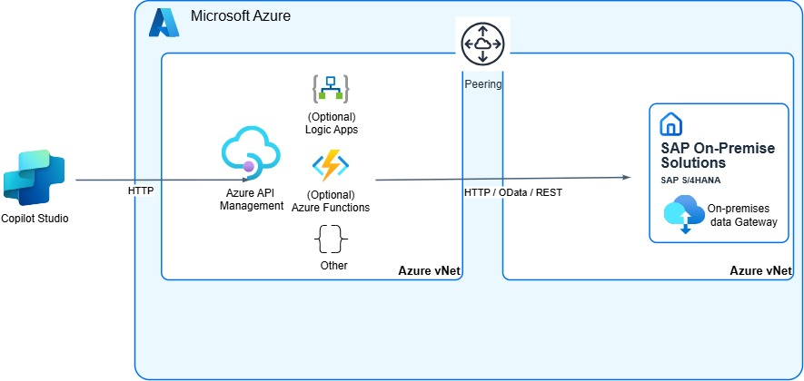

# Leveraging Azure API Management and vnet Peering (e.g. SAP S/4HANA Prviate Cloud or Native)

## Why would you use this scenario?
A lot of customers are running their SAP Systems on Azure, either operating it by themselves or in a RISE / SAP S/4HANA Private Cloud Edition setup. 

In both cases, the fact that the SAP system is running in an Azure virtual network (vnets), enables other Azure services to connect to the SAP system without the need to go over the internet. Different vnets can be connected / peered so that internal IP addresses of the SAP system can be exposed to other Azure services

> [!Note]
> It is important to point out that the setup also works if you SAP system is not running on Azure. In this case you can still use Azure API Management, but vnet peering is obviously not possible. In case you need to combine this setup with a proxy like the [on-premises data gateway](./Architecture-OPDG.md)

Some of the Azure services frequenetly used are Logic Apps and Azure API Management. Especially Azure API Management enables SAP customer not only to expose their APIs in a secury and managed way, but also expose them as MCP servers (currently in preview). In addition sophisticated authentication flows to enable Single Sign-On / Principal progation are also documented and tested with lots of customers. 

* [Set up Microsoft Entra ID, Azure API Management, and SAP for SSO from SAP OData connector](https://learn.microsoft.com/en-us/power-platform/sap/connect/entra-id-apim-oauth)

## Setup & Configuration
In order to use Azure API Management with a peered virutal network where your SAP System is running, you need to deploy ("inject") your API Management instance in a subnet in a non-internet-routable network to which you control access. This network has to be peered with the network your SAP system is running. 

* [Quickstart: Create a new Azure API Management instance by using the Azure portal](https://learn.microsoft.com/en-us/azure/api-management/get-started-create-service-instance)
* [Use a virtual network to secure inbound or outbound traffic for Azure API Management](https://learn.microsoft.com/en-us/azure/api-management/virtual-network-concepts#virtual-network-injection-classic-tiers)
* [Azure virtual network peering](https://learn.microsoft.com/en-us/azure/virtual-network/virtual-network-peering-overview)
* [Connectivity with SAP RISE](https://learn.microsoft.com/en-us/azure/sap/workloads/rise-integration-network)

### Agent & Copilot Development 
The connectivity via Azure API Management allows you to consume any HTTP based services from the SAP system. Most likely these are (SAP) OData Services which can easily be consumed by the SAP OData Connector in Copilot Studio, and also via pro-code solutions (e.g. Microsoft 365 Agent Toolkit in Visual Studio Code)

* [Get started with the SAP OData Connector](https://learn.microsoft.com/en-us/power-platform/sap/connect/sap-odata-connector)
* [Microsoft 365 Agents Toolkit - Add cloud resources and API connection](https://learn.microsoft.com/en-us/microsoftteams/platform/toolkit/add-resource)

### Integration & Connectivity Infrastructure
You have to define the APIs which should be exposed via Azure API Management from the SAP System first. This can be done manually, or also using OData or OpenAPI specifications.

* [Define APIs](https://learn.microsoft.com/en-us/azure/api-management/add-api-manually)

In addition to that you can leverage Policies that enable Single Sign-On / Principal Propagation to the SAP backend system. 

* [Policy for Azure API Managmenet for SSO](https://github.com/Azure/api-management-policy-snippets/blob/master/examples/Request%20OAuth2%20access%20token%20from%20SAP%20using%20AAD%20JWT%20token.xml)
* [Setup SSO End-to-End](https://github.com/hobru/Single-Sign-On-with-Power-Platform-and-SAP)

### Proxy / Connectivity
One of the main benefits of this setup is, that you do not need an additional proxy. Azure API Management acts as this proxy and ensures that you SAP system is protected behind a firewall in a private Network. 

### Backend Systems & Data Sources
For available SAP OData and REST APIs, check the SAP Business Accelerator Hub. 
If no fitting APIs are avaialble, you can create your own services using the RESTful Application Programming Model or use the SAP Gateway Service Builder.  

* [SAP Business Accelerator Hub](https://api.sap.com/)
* [ABAP RESTful Application Programming Model - Creating an OData Service](https://help.sap.com/docs/abap-cloud/abap-rap/creating-odata-service)
* [Managing an SAP Gateway Service](https://learning.sap.com/learning-journeys/building-odata-services-with-sap-gateway/managing-an-sap-gateway-service)
