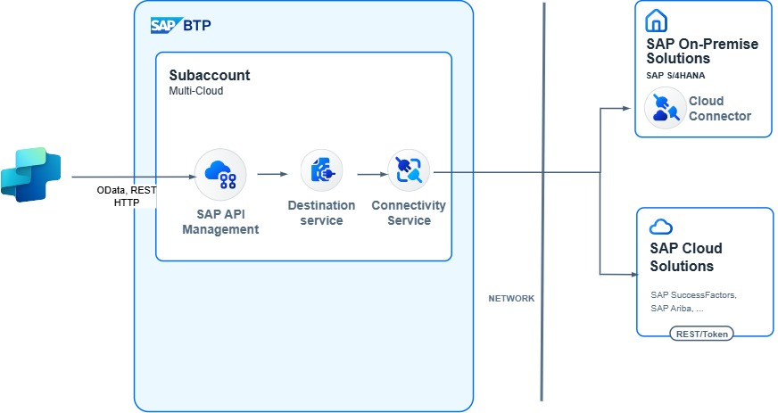

# Leveraging SAP Business Technology Platform (with SAP API Management and SAP Cloud Connector)

## Why would you use this scenario?
A lot of customers that want to build a Copilot connected to SAP, already have the SAP Business Technology Platform in place. The huge benefit here is, that integrations to the SAP Backend system -- often on-prem -- are already established using SAP Cloud Connector. 

Whether you are using Microsoft Copilot Studio, Azure AI Foundry or the Microsoft 365 Agent AI Toolkit, the connectivity to the services from your SAP backend system, are exposed via SAP BTP services like SAP API Management, SAP Integration Suite or a custom developed SAP App Proxy. 

This combination enables the SAP team (managing SAP BTP and the access to the SAP System) at the customer to work well together with the Microsoft team (building the Copilot Agent). 

In most cases the Copilot would call a REST based API (OData, REST, SOAP). This API is exposed and protected via services on the SAP Business Technology Platform. Here also the authentication can happen (so that true SSO / Principal propagation scenarios can be used). 

SAP BTP then forwards the request via the SAP Cloud Connector to the SAP Backend System. 

(This architecture only depicts one path; You can use multiple variations for the connection)

## Setup & Configuration
For this scenario in most cases the SAP Business Technology platform is  in place and also the SAP Cloud Connector is already installed.

### Agent & Copilot Development 
In Copilot Studio use the SAP OData Connector or the HTTP Connector to connect to the service exposed on BTP. You can either use the connectors directly from Copilot Studio, or use a Power Automate flow to add additional logic before / after calling the API. 
Using the SAP OData Connector you can also implement Single Sign-On from Entra ID to the SAP Business Technology Platform.

* [Get started with the SAP OData Connector](https://learn.microsoft.com/en-us/power-platform/sap/connect/sap-odata-connector)
* [What is Microsoft Power Platform integration with SAP?](https://learn.microsoft.com/en-us/power-platform/sap/explore/power-platform-and-sap-integration)
* [Power Platform + SAP: Updates via SAP OData services](https://youtu.be/mez5qIZmrfM?si=b22hyxSTlspy-HR_)

### Authentication
In most cases the expecation from users using Copilot is that there is a principal propagation in place, meaning the user that is logged on to Copilot, is also the user that is authenticated in the SAP backend system.This not only ensures that auditing and activity traces in the SAP system are tracked in the user context, but also that the user only has access to the data that he or she is allowed to have. 

For all integration scenarios via the SAP Business Technology Platform Principal Propagation flows are documented.  

* [Principal propagation in a multi-cloud solution between Microsoft Azure and SAP, Part IV: SSO with a Power Virtual Agents Chatbot and On-Premises Data Gateway](https://community.sap.com/t5/technology-blog-posts-by-members/principal-propagation-in-a-multi-cloud-solution-between-microsoft-azure-and/ba-p/13519225)
* [Power Platform + SAP OData - Single Sign-On - Happy path](https://youtu.be/NSE--fVLdUg?si=eYnXYX5DLuyMwuY3)

### Integration & Connectivity Infrastructure
The easiest way to expose APIs from your SAP backend system, is via the SAP Integration Suite. In this example we are using the SAP API Management. The policy of the API Proxy can also be enhanced to support the Principal Propagation Flow to enable Single Sign-On from the Copilot Agent to the SAP backend system. 

* [Principal Propagation via Entra Id](https://api.sap.com/policytemplate/Principal_Propagation_via_Entra_ID)
* [SuccessFactors Principal Propagation via Entra ID](https://api.sap.com/policytemplate/SuccessFactors_Principal_Propagation_via_Entra_Id)
* [Introducing SAP API Management](https://learning.sap.com/learning-journeys/developing-with-sap-integration-suite/introducing-sap-api-management_dd668e10-08ab-4763-9342-3e6cc7e74c18)

### Proxy / Connectivity
When connecting to a public facing SAP System (e.g. SAP SuccessFactors, SAP S/4HANA Cloud, Public Edition), the SAP API Management solution can connect directly to the backend system. 
If the SAP System is behind a firewall (e.g. running on-premises), then the SAP Cloud Connector can be used to link your on-premises system with SAP API Management

* [Cloud Connector](https://help.sap.com/docs/connectivity/sap-btp-connectivity-cf/cloud-connector)

### Backend Systems & Data Sources
For available SAP OData and REST APIs, check the SAP Business Accelerator Hub. 
If no fitting APIs are avaialble, you can create your own services using the RESTful Application Programming Model or use the SAP Gateway Service Builder.  

* [SAP Business Accelerator Hub](https://api.sap.com/)
* [ABAP RESTful Application Programming Model - Creating an OData Service](https://help.sap.com/docs/abap-cloud/abap-rap/creating-odata-service)
* [Managing an SAP Gateway Service](https://learning.sap.com/learning-journeys/building-odata-services-with-sap-gateway/managing-an-sap-gateway-service)