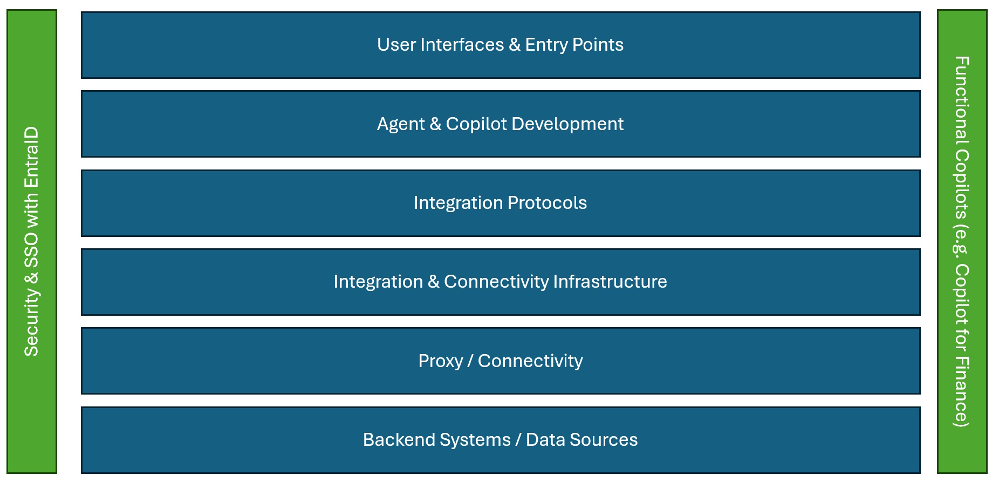
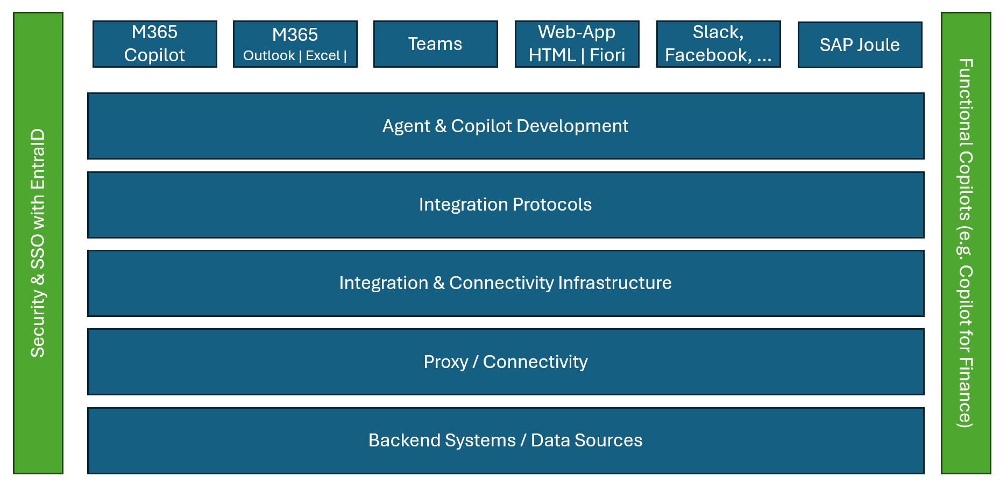
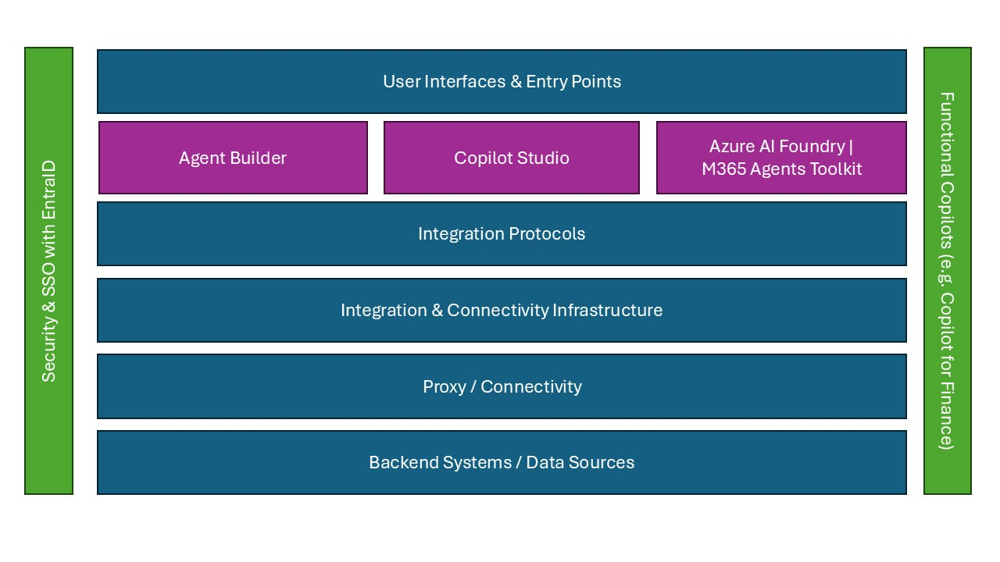
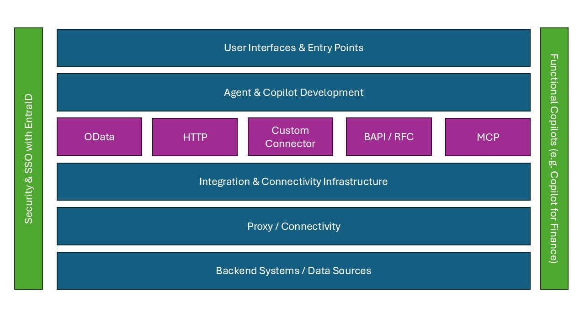
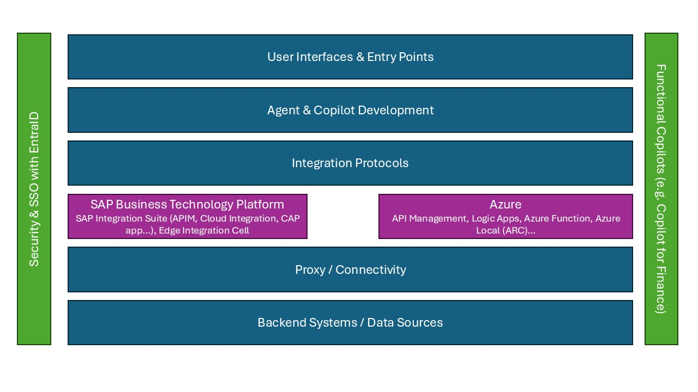
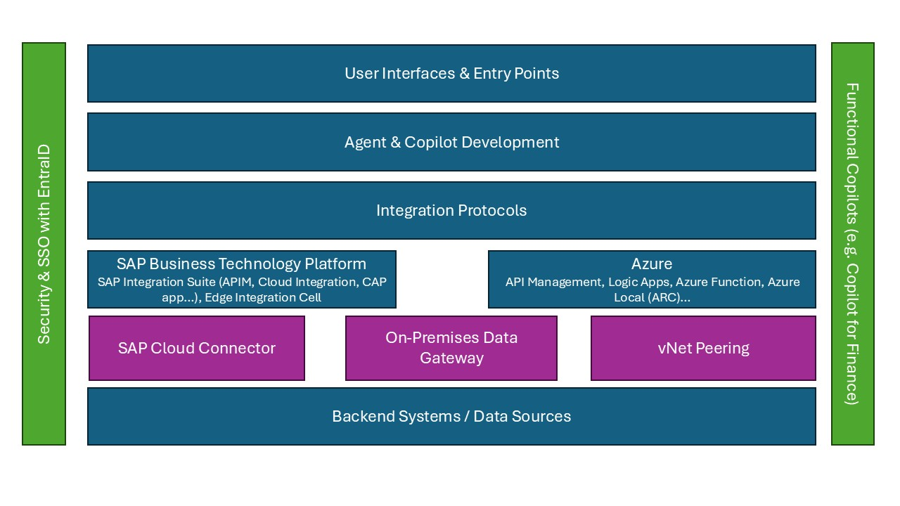

# Copilots with SAP
Developing Copilot Agents with SAP data depends very much on the infrastructure, architecture and components that are available in your landscape today. This page provides an overview on 
* What options are available?
* Why would you choose one options vs. another? 
* How can you get started to implement these integrations?

To get started, take a look at the [recommended architecture options](#recommendation-matrix)

## Building an Agent
> [!Note]
> This section is from  https://learn.microsoft.com/en-us/training/modules/ai-agent-fundamentals/3-agent-development

### Choosing an agent development solution covers multiple facets. 

With such a wide range of available tools and frameworks, it can be challenging to decide which ones to use. Use the following considerations to help you identify the right choices for your scenario:

* For business users with little or no software development experience, Copilot Studio agent builder in Microsoft 365 Copilot Chat provides a way to create simple declarative agents that automate everyday tasks. This approach can empower users across an organization to benefit from AI agents with minimal impact on IT.
* If business users have sufficient technical skills to build low-code solutions using Microsoft Power Platform technologies, Copilot Studio enables them to combine those skills with their business domain knowledge and build agent solutions that extend the capabilities of Microsoft 365 Copilot or add agentic functionality to common channels like Microsoft Teams, Slack, or Messenger.
* When an organization needs more complex extensions to Microsoft 365 Copilot capabilities, professional developers can use the Microsoft 365 Agents SDK to build agents that target the same channels as Copilot Studio.
* To develop agentic solutions that use Azure back-end services with a wide choice of models, custom storage and search services, and integration with Azure AI services, professional developers should use Foundry Agent Service.
* Use the Microsoft Agent Framework to develop single, standalone agents or build multi-agent solutions that use different orchestration patterns.

## Overview
When building Copilot Agents (whether integrated in Microsoft 365 Copilot or autonmous agents) for SAP, there are multiple options. On a high level, the agents will leverage the following components:
- User Interfaces & Entry Points
- Agent & Copilot Development
- Integration Protocols
- Integration & Connectivity Infrastructure
- Proxy / Connectivity
- Backend Systems / Data Sources

Microsoft and SAP provide a wide range of integration options to realize this end-to-end flow. The choice on which flow to use depends very much on the approach and available skillsets, but also on the existing setup that you already have in place: Are you using the SAP Business Technology Platform? Do you use Azure Integration Services? Is your SAP system already running on Azure? 

These and more questions can influence the recommended integration architecture. 

## Highlevel Architecture
### User Interfaces & Entry Points
Although the adoption of autonomous agents is growing, a lot of agents are still accessed by a human and need to show-up "somewhere". One goal of Copilot agents for SAP is that the user should be able to stay within their flow of work. In a lot of cases, this flow of work is a Microsoft 365 application (Outlook, Teams, Excel, ...), but it can also be another website, collaboration tool or (almost) anything else.    

#### Microsoft 365 Copilot
For Copilot, there is the Microsoft 365 Copilot application app which gives you access to all your Microsoft 365 data and also access to your agents. 

Another place to use your apps is in the different M365 applications. You can open Copilot (and your agents) directly from within Outlook, which can be helpful if you just received an email from a supplier asking for the latest status of an order. Or from within Excel, when you work on a long list of Sales Orders and you need to ask your Copilot agent whether there is an update to the status of your Sales Orders.    

* [Microsoft 365 Copilot](https://www.microsoft.com/en-us/microsoft-365/copilot)

#### Teams
Since a lot of collaboration happens in Microsoft Teams, it is important to highlight that Copilot Agents can also run in Teams. You can add them to ongoing conversations and meetings, and also interact with them 1:1. Think of a discussion that you have with your manager and now the agent can help you receive the latest information from your SAP SuccessFactors system about the goals defined there. 

#### Websites
Copilot Agents can also run on websites. They can help and guide a user where to navigate, or provide answers without the need to find the right site. This integration can also be done in an SAP Fiori Launchpad or SAP Build Workzone. Such an Agent can help you look-up products in your SAP system or also help a supplier -- on their Supplier portal -- to check the status of the latest invoice. 

#### Slack, Facebook, ...
Copilot Agents can also be deployed to other collaboration and social media tools like Slack and Facebook. In a Slack chat the agent can interact with customers to retrieve the latest information about a complaint raised in the SAP system. 

#### SAP Joule
SAP and Microsoft have been working on a dedicated, bi-directional ingration of SAP Joule and Microsoft 365 Copilot. Via this integration, Microsoft 365 Copilot can also be integrated within Joule. This integration does not yet extend to custom-built agents (like agents built from Copilot Studio), but it allows end-users to access SAP features diretly via an SAP Joule agent. 

### Agent & Copilot Development 
Depending on the skillset and complexity of the Copilot Agent that you want to build, Microsoft offers different tools to get you started. From no-code tools like Agent Builder to pro code tools like the Microsoft 365 Agents Tookit in Visual Studio Code. 

#### Agent Builder
Microsoft Agent Builder is a low-code tool within Microsoft Copilot Studio that allows users to create Copilots using natural language or manual configuration. Designed for business users, IT professionals, and developers alike, Agent Builder enables the rapid development of agents that can automate workflows, answer questions, and integrate with Microsoft 365 apps and enterprise systems. With built-in support for knowledge sources, templates, and extensibility, it simplifies the creation of customized AI experiences that enhance productivity and streamline business processes.

The use of Knowledge sources allows users to enrich the Copilot with SAP-specific information. In the context of SAP, the focus is on read-only scenarios.

#### Copilot Studio
Microsoft Copilot Studio is a powerful, low-code platform that enables organizations to build, customize, and deploy AI-powered copilots tailored to their unique business needs. With seamless integration across Microsoft 365 and a vast library of over 1,000 prebuilt connectors—including enterprise systems like SAP, ServiceNow, Salesforce, and Dataverse—Copilot Studio allows users to automate complex workflows, access real-time data, and deliver intelligent, context-aware experiences. Whether you're streamlining operations, enhancing customer service, or empowering employees with self-service tools, Copilot Studio provides the flexibility and scalability to bring AI into every corner of your business.

#### Microsoft 365 Agent Toolkit
Microsoft 365 Agents Toolkit is a suite of tools for building enterprise-ready agents and apps that work across Microsoft 365 Copilot, Teams, Office, web, and other third-party messaging channels. 

Microsoft 365 Agents Toolkit is an evolution of Teams Toolkit.

https://learn.microsoft.com/en-us/microsoft-365/developer/overview-m365-agents-toolkit
Seamless integration with Microsoft 365 Agents SDK to build self-hosted agents.

The following table provides an overview of the different tools and their features:
| | Agent Builder | Copilot Studio | AI Foundry |
| --- | --- | --- | --- | 
| **Knowledge grounding**       | Built-in RAG tied to enterprise contents (SharePoint, M365 docs, and Bing search)     | Flexible data connections to organization data (M365, and connectors to other enterprise data)        | Comprehensive retrieval integration with security, either built-in or through own APIs/vector index  |
| **User interfaces**           | M365 Copilot Chat – surfaced with M365 Copilot experiences like in Teams              | M365 Copilot Chat + embedded in M365/custom apps and chat                                             | Bring-your-own-UI next to integration with M365 Copilot and Apps                                     |
| **Foundation models**         | Built-in LLMs (same models behind M365 Copilot, e.g., GPT-4 or other managed models)  | Configurable models (BYOM through AI Foundry) + agent-specific fine-tuning                            | Maximum model flexibility (Foundry model catalog, custom models, and FT models)                      |
| **Pre-built tools**           | Minimal toolset for RAG from connected knowledge sources                              | Large tool library through pre-built connectors to extend agent actions                               | Extensive and extensible tool integrations (1st party tools, connectors to LoBs, and custom)         |
| **Tool use via MCP**          | N/A – not supported for end users                                                     | Available through marketplace with pre-built 1P/3P MCP servers                                        | Fully support MCP for pre-built 1P/3P MCP servers and custom MCP servers                             |
| **Memory & learning**         | Short term memory within the same chat session                                       | Short term memory of the session                                                                      | Extensive stateful short/long-term memory                                                            |
|                               | Not persistent across sessions                                                        | Extensible with external storage                                                                      | Integrated retrieval                                                                                  |
| **Orchestrator & MAS**        | Not supported – only single stand-alone agent                                        | Multi-agent orchestration with an orchestrator pattern + connected agents                             | Built-in multi-agent orchestration supporting various conversational patterns                         |

### Integration Protocols
Depending on the kind of backend system and the skills avaialble, you can connect to your SAP system using different protocols. 

* The OData protocol has become an open standard and is used not only by all SAP Fiori applications, but also accross the broader SAP stack (e.g. SAP SuccessFactors, SAP Ariba, ...). Not only the latest SAP products (e.g. SAP S/4HANA private-cloud and public-cloud) are supported, but also older SAP systems (SAP ECC) can expose OData services using the SAP Gateway. Finally, programming models like RAP and CAP make the development of new OData services very easy. 

* The BAPI/RFC interfaces have been around since the 1990s. Typically SAP teams have a lot of knowledge and thousands of (custom) BAPI/RFCs are available in customers SAP system. Using dedicated connectors, these APIs can still be consumed in Copilots. 

* SOAP and other REST services can also expose SAP data and consumed via the different development tools. In some cases a Custom Connector can be developed to proxy complex interaction patterns with the SAP system. 

* MCP, the Model Context Protocol, provides a new interesting way to expose APIs in a standardized way. Similar to OData services, services exposed as MCP servers can be consumed by any MCP Client.  

### OData
OData is the Go-To protocol for transactional SAP applications. SAP Fiori, SAP ECC, SAP S/4HANA; SAP SuccessFactors, SAP Ariba, SAP Concur, ... all support OData. The [SAP Business Accelerator Hub](https://api.sap.com/) lists thousands of out of the box OData Services. The [SAP Fiori Reference App Library](https://fioriappslibrary.hana.ondemand.com/sap/fix/externalViewer/) shows additional OData services available and supported out of the box by SAP. 

If no out of the box OData service is avaialble, custom [CDS views](https://learning.sap.com/learning-journeys/acquire-core-abap-skills/working-with-cds-view_c289f74d-675e-4084-9d90-5635958ec604) can be created (via [RAP](https://pages.community.sap.com/topics/abap/rap) or [CAP](https://developers.sap.com/tutorials/introduction..html)) to expose additional OData services. 

These OData services cannot only be consumed in Copilot scenario, but due to the standardization thousands of client (including Microsoft Excel, PowerBI, ...) provide out of the box support to consume OData services. 

In addition, OData supports the latest authentication protocols like OAuth and SAML.

For Copilot scenarios, there is a common support across all tools. 
* Agent Builder is supporting OData services via the Knowledge Source functionality, enabling end-users to use SAP systems as a knowledge source
* In addition to the Knowledge Source functionality, Copilot Studio has a dedicated SAP OData Connector which supports all CRUD operations supported by the underlying SAP OData services. In addition detailed documentation about implementing Single Sign-On / Principal Propagation to mutliple SAP Systems is available. 
* Azure AI Foundry supports OData services both via a low-code connector and via pro-code development extensions 
* The Agent Toolkit allows developers to use multiple libraries to connect to OData services

### HTTP (SOAP & REST)
A lot of older or aquired SAP Systems support SOAP and REST services. These protocols are support via an HTTP Connector or a custom connector in Copilot Studio. Via these connectors other HTTP protocols are also supported. 

For pro-code integrations via Azure AI Foundry or the Agent Toolkit, HTTP calls can be done via commonly available packages. 

### BAPI / RFC
SAP ECC and SAP S/4HANA on-prem / private cloud edition systems still support and offer BAPI and RFC. These propriatary protocols offer a very efficient, but closed integration with other system. The Agent Toolkit can use the SAP .Net Connector SDK to connect to these APIs, but an enterprise ready implementation can be complicated. 

Copilot Studio already provides a well-proven SAP BAPI / RFC connector that allows users to connect to older systems. The support is done using the on-premises Data Gateway together with the [SAP .Net Connector](https://support.sap.com/en/product/connectors/msnet.html) which has to be downloaded with a so called S-User.  

The SAP RFC Connector in Copilot Studio also supports Single Sign-On / Principal Propagation via Kerberos and X.509 certificates. 

### MCP
MCP, the [Model Context Protocol](https://github.com/modelcontextprotocol), is an open protocol that enables seamless integration between LLM applications, like Copilot, and external data sources and tools. In contrast to the simple API based integration mentioned above, an MCP based integration enables the Copilot to identify and create the required payload to retrieve data from the SAP system in a very dynamic and efficient way. 

Hundreds of open source MCP servers are already available (the [Azure MCP Registry](https://mcp.azure.com/) not only provides a list of first curated MCP servers, but also offers customers a possibility to create their own in-house MCP servers), and tools like [Azure API Management](https://learn.microsoft.com/en-us/azure/api-management/export-rest-mcp-server) enable you to create new MCP servers out of existing APIs. 

### Integration & Connectivity Infrastructure
Whether to have one single point of entry or to be able to control access to the backend system, a lot of customers are using an Integration and Connectivity layer to route the calls from Copilot to the SAP backend system. 

The SAP Business Technology Platform or Azure Integration Services are two very common components in these integrations. 

#### SAP Business Technology Platform
A lot of customers already have services like SAP API Management or SAP Integration Suite as part of the SAP Business Technology Platform, BTP in place. The BTP is then often already connected to SAP backend systems, which obviously simplifies the connection from Copilot to SAP. 
All Copilot tools can leverage APIs that are exposed via SAP Business Technology Platform. Using the SAP Cloud Connector (see [here](#sap-cloud-connector)) even SAP systems behind Firewalls can be accessed in a secure manner. Leveraging tools like SAP API Management additional features like Throttling, Quota Handling or also authentication steps can be performed.  

#### Azure Integration Services
Azure provides several tools to integrate with backend systems like SAP. Most prominent in the Copilot Studio scenario is Azure API Management and Azure Logic Apps. Both provide an easy way to connect to APIs (in the case of Logic Apps both HTTP and BAPIs) and control the access to the SAP system. A huge benefit of this setup is if your SAP System is also running on Azure. In this case the connectivity can be further secured by using vnet peering. 

### Proxies / Connectivity
In a lot of cases the SAP System is protected by a Firewall. This means access from the internet (e.g. from M365 Copilot) is not possible directly. Instead, a proxy needs to be installed. 

#### SAP Cloud Connector
For a lot of SAP customers, the SAP Business Technology Platform with either SAP Integration Suite or a simple App Router is already in place. In this case, the SAP Cloud Connector is probably used to bridge the Firewall-Protection and to be able to connect to the SAP system (either on-prem or in a cloud)

#### On-Premise Data Gateway
The on-premise data gateway (OPDG) has been around for many years, mainly in the context of the Power Platform. OPDG not only allows you to bridge the Firewall-Protection, but it also enables you to translate the SAP DIAG protocol used by BAPI / RFCs into HTTP calls that can be used by Copilot Studio / Power Platform. 

If you are looking to leverage BAPI / RFC, you have to install the OPDG along with the SAP .Net Connector (download here, SAP User is required). This will not only allow you to access the SAP system behind a firewall, but also leverage BAPIs / RFCs in your system. 
If you want to connect to OData services behind a firewall, the OPDG - similar like the SAP Cloud Connector - also allows you to do that. 

#### vnet Peering
If you are running your SAP System on Azure (either native or on RISE), you can also benefit from peering your vnets with Azure. This would allow your Azure API Management to access the SAP system without the need of an additional proxy like SAP Cloud Connector or on-premise data gateway. The SAP system does not have to expose any IP to the internet, but Azure API Management (or other Azure services) can just access the SAP system via interal IPs. 

This provides not only the best security, but also reduces the number of hops and latency. 

### Backend Systems & Data Sources
Since the tools and protocols mentioned above are indifferent of the actual backend system, the integration of Copilots to SAP ranges from SAP S/4HANA Public Cloud systems (using OData) to very old SAP R/3 system that can expose their data either via RFC/BAPI or with an standalone SAP Gateawy that exposes an OData Services. Authentication options vary on the used protocol and application. Here is a first overview of integration options
| Application | Potential Protocols | Authentication |
| --- | --- | --- |
| R/3, SAP ECC | BAPI/RFC | SAP UID / Kerberos |
| S/4HANA on-prem / native / private cloud | BAPI/RFC, OData | SAP UID / Kerberos |
| S/4HANA public cloud | OData | OAuth |
| SAP SuccessFactors | OData / HTTPS | OAuth |

## Recommended  Integration Patterns
The following list provides an overview of reference architectures. There is not only one, because it depends very much on your existing infrastructure and what components you are using. In the simplest form (for a first POC), you can just use Copilot Studio, use the SAP OData Connector and connect directly to your SAP system in the cloud ([Option #1](https://github.com/hobru/Microsoft-Learning/blob/main/Architecture-Demo.md))

### Recommendation Matrix
- Are you running your SAP system on Azure including RISE? Do you have a good Azure practice in-house? [Leveraging Azure API Management and vnet Peering (e.g. SAP S/4HANA Prviate Cloud or Native)](Architecture-APIM+vnet.md)
- Do you want to use BAPI / RFC? Take a look at [Leveraging On-premise data gateway with access to BAPI / RFCs and OData Services](Architecture-OPDG.md)
- Are you already using SAP Business Technology Platform and have connected your SAP backend system to it? [Leveraging SAP Business Technology Platform (with SAP API Management and SAP Cloud Connector)](Architecture-BTP+APIM.md)

### Overview

* [SAP System publically available (most likely a demo scenario)](Architecture-Demo.md)
* [Leveraging SAP Business Technology Platform (with SAP API Management and SAP Cloud Connector)](Architecture-BTP+APIM.md)
* [Leveraging On-premise data gateway with access to BAPI / RFCs and OData Services](Architecture-OPDG.md)
* [Leveraging Azure API Management and vnet Peering (e.g. SAP S/4HANA Prviate Cloud or Native)](Architecture-APIM+vnet.md)
* [Leveraging Azure Logic Apps for additonal configuruation](Architecture-LogicApps.md)
