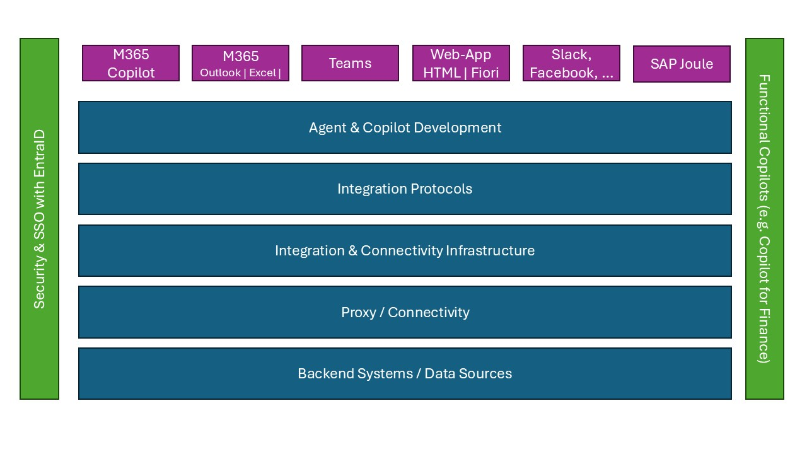

# Copilots with SAP

## Overview
When building Copilot Agents (whether integrated in Microsoft 365 Copilot or autonmous agents) for SAP, there are multiple options doing that. On a high level, the agents will leverage the following components:
- User Interfaces & Entry Points
- Agent & Copilot Development
- Integration Protocols
- Integration & Connectivity Infrastructure
- Proxy / Connectivity
- Backend Systems / Data Sources

Microsoft and SAP provide a wide range of integration options to realize this end-to-end flow. The choice on which flow to use, very much depends on the approach and available skillsets, but also the existing setup that you have already in place: Are you using the SAP Business Technology Platform? Do you use Azure Integration Services? Is your SAP system already running on Azure? 

These questions can influence the recommended integration architecture. 

## Highlevel Architecture
### User Interfaces & Entry Points
Althought autonmous agents are a growing in adoption, still a lot of agents are accessed by a human and need to show-up "somewhere". One goal of Copilot agents for SAP is that the user should stay in their flow of work. In a lot of cases this flow of work is a Microsoft 365 application (Outlook, Teams, Excel, ...), but it can also be antoher website, another collaboration tool or (almost) anything else.    

#### Microsoft 365 Copilot
For Copilot there is the Microsoft 365 Copilot application app which gives you access to all your Microsoft 365 data and also access to your agents. 

Another place to use your apps is in the different M365 applications. You can open Copilot (and your agents) directly from within Outlook, which can be helpful if you just received and email from a supplier asking for the latest status of an order. Or from within Excel, when you work on a long list Sales Orders and you need to ask your Copilot agent whether there is an update to the status of your Sales Orders.    

* [Microsoft 365 Copilot](https://www.microsoft.com/en-us/microsoft-365/copilot)

#### Teams
Since a lot of collaboration happens in Teams, it is important to highlight that Copilot Agents can also run in Teams. You can add them to ongoing conversations and meetings or also interact with them 1:1. Think of a discussion that you have with your manager and now the agent can help you receive the latest information from you SAP SuccessFactors system about the goals defined there. 

#### Websites
Copilot Agents can also run on Websites. They can help and guide a user where to navigate or provide answers without the need to find the right site. This integration can also be done in an SAP Fiori Launchpad or SAP Build Workzone. Such an Agent can help you look-up products in your SAP system or also help a supplier -- on their Supplier portal -- to check the status of the latest invoice. 

#### Slack, Facebook, ...
Copilot Agents can also be deployed to other collaboration and social media tools like Slack and Facebook. In a Slack chat the agent can interact with customers to retrieve the latest information about a complaint raised in the SAP system. 

#### SAP Joule
SAP and Microsoft have been working on a dedicated, bi-directional ingration of SAP Joule and Microsoft 365 Copilot. Via this integration Microsoft 365 Copilot can also be integrated within Joule. This integration does not yet extend to custom build agents (like build from Copilot Studio), but it allows end-users to access SAP features diretly via an SAP Joule agent. 

### Agent & Copilot Development 
#### Agent Builder
Microsoft Agent Builder is a low-code tool within Microsoft Copilot Studio that empowers users to create Copilots using natural language or manual configuration. Designed for business users, IT professionals, and developers alike, Agent Builder enables the rapid development of agents that can automate workflows, answer questions, and integrate with Microsoft 365 apps and enterprise systems. With built-in support for knowledge sources, templates, and extensibility, it simplifies the creation of customized AI experiences that enhance productivity and streamline business processes.

The use of Knowledge sources allows users to enrich the Copilot with SAP specific information. In the context of SAP, the focus is on read-only scenarios.

#### Copilot Studio
Microsoft Copilot Studio is a powerful, low-code platform that enables organizations to build, customize, and deploy AI-powered copilots tailored to their unique business needs. With seamless integration across Microsoft 365 and a vast library of over 1,000 prebuilt connectors—including enterprise systems like SAP, ServiceNow, Salesforce, and Dataverse—Copilot Studio allows users to automate complex workflows, access real-time data, and deliver intelligent, context-aware experiences. Whether you're streamlining operations, enhancing customer service, or empowering employees with self-service tools, Copilot Studio provides the flexibility and scalability to bring AI into every corner of your business.

#### Azure AI Foundry
https://learn.microsoft.com/en-us/azure/ai-foundry/what-is-azure-ai-foundry

Knowledge tools
To keep your AI agent informed with richer context from various data sources. The Foundry Agent Service has covered a wide range of data types:

private data: Azure AI Search, File Search, Microsoft Fabric, and more
public web data: Grounding with Bing Search
licensed data: Tripadvisor, Morningstar
unstructured data: Azure AI Search, File Search
structured data: Microsoft Fabric and more
Action tools
To streamline workflows with your AI agent with capabilities to take actions. The Foundry Agent Service provides different action tools for you with different level of flexibility, control, and ease of integration:

Deep Research tool: Web-based integrated deep research pipeline with the o3-deep-research model and Grounding with Bing Search.
Azure Logic Apps: Low-code / no-code solution to add a workflow to your AI Agent
OpenAPI Spec tool: Bring an existing OpenAPI specification of a service API you want to add to your AI agent, with no or minor changes.
MCP tool: Bring an existing Model Context Protocol (MCP) endpoint that you want to add to your AI agent.
Function calling: Write your own custom, stateless functions to define the expected behaviors.
Azure Functions: Write and manage your own custom, stateful functions.
Browser Automation: Perform real-world browser tasks through natural language prompts.

#### Microsoft 365 Agent Toolkit
Microsoft 365 Agents Toolkit is a suite of tools for building enterprise-ready agents and apps that work across Microsoft 365 Copilot, Teams, Office, web, and other third-party messaging channels. 

Microsoft 365 Agents Toolkit is an evolution of Teams Toolkit.

https://learn.microsoft.com/en-us/microsoft-365/developer/overview-m365-agents-toolkit
Seamless integration with Microsoft 365 Agents SDK to build self-hosted agents.

### Integration Protocols

### Integration & Connectivity Infrastructure

### Proxies / Connectivity
In a lot of cases the SAP System is protected by a Firewall. So access from the internet (e.g. from M365 Copilot) is not possible directly. Instead a proxy needs to be installed. 

#### SAP Cloud Connector
For a lot of SAP customers, the SAP Business Technoogy Platform with either SAP Integration Suite or a simple App Router is already in place. In this case, the SAP Cloud Connector is probably used to bridge the Firewall-Protection and to be able to connect to the SAP system (either on-prem or in a cloud)

#### On-Premise Data Gateway
The on-premise data gateway (OPDG) has been around for many years mainly in the context of the Power Platform. OPDG not only allows you to bridge the Firewall-Protection, but it also enables you to translate the SAP DIAG protocol used by BAPI / RFCs into HTTP calls that can be used by Copilot Studio / Power Platform. 
If you are looking to leverage BAPI / RFC you have to install the OPDG along with the SAP .Net Connector (download here, SAP User is required). This will not only allow you to access the SAP system behind the fireall, but also leverage BAPIs / RFCs in your system. 
If you want to connect to OData services behind a firewall, the OPDG - similar like the SAP Cloud Connector - also allows you to do that. 

### Backend Systems & Data Sources
Since the tools and protocols mentioned above are indifferent of the actual backend system, the integration of Copilots to SAP ranges from SAP S/4HANA Public Cloud systems (using OData) to very old SAP R/3 system that can expose their data either via RFC/BAPI or with an standalone SAP Gateawy that exposes an OData Services. Authentication options vary on the used protocol and application. Here is a first overview of integration options
| Application | Potential Protocols | Authentication |
| --- | --- | --- |
| R/3, SAP ECC | BAPI/RFC | SAP UID / Kerberos |
| S/4HANA on-prem / native / private cloud | BAPI/RFC, OData | SAP UID / Kerberos |
| S/4HANA public cloud | OData | OAuth |
| SAP SuccessFactors | OData / HTTP | OAuth |

## Example Integration Patterns
The following list provides an overview of reference architectures. There is not only one, because it depends very much on your existing infrastructure and what components you are using. In the simplest form, you can just use Copilot Studio, use the SAP OData Connector and connect directly to your SAP system in the cloud (Option #1)
* [SAP System publically available (most likely a demo scenario)](Architecture-Demo.md)
* [Leveraging SAP Business Technology Platform (with SAP API Management and SAP Cloud Connector)](Architecture-BTP+APIM.md)
* [Leveraging On-premise data gateway with access to BAPI / RFCs and OData Services](Architecture-OPDG.md)
* [Leveraging Azure API Management and vnet Peering (e.g. SAP S/4HANA Prviate Cloud or Native)](Architecture-APIM+vnet.md)
* [Leveraging Azure Logic Apps for additonal configuruation](Architecture-LogicApps.md)
