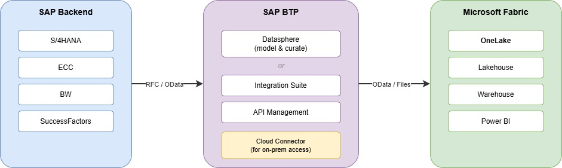

# Via SAP BTP / Datasphere

> [!Important]
> When consuming SAP APIs and interfaces, always ensure your usage complies with [SAP's API Policy](https://help.sap.com/doc/sap-api-policy/latest/en-US/API_Policy_latest.pdf). Please check with your SAP contact or account team if you have questions about permitted API usage in your specific scenario.

This architecture leverages SAP Business Technology Platform (BTP)and/or SAP Datasphere as an intermediate layer between SAP backend systems and Microsoft Fabric.

## Why Would You Use This Scenario?

- You are already using **SAP BTP** and have your SAP systems connected to it
- You are using **SAP Datasphere** for data modeling, governance, or federation on the SAP side
- You want SAP teams to own the **data curation and business logic** before exposing data to Fabric
- You need to combine data from **multiple SAP systems** before landing it in Fabric
- You want a clear separation of responsibilities: SAP team manages data preparation, analytics team consumes in Fabric

## Setup & Configuration

### Option A: SAP Datasphere → Fabric

SAP Datasphere can model and curate data from multiple SAP sources and expose it for consumption:

1. **In SAP Datasphere:**
   - Connect your SAP backend systems (S/4HANA, ECC, BW, SuccessFactors, ...) as source systems
   - Create Spaces and model your data using views, analytic models, or data flows
   - Expose curated datasets via OData or replicate to an external data store (e.g. Azure Data Lake Storage)

2. **In Microsoft Fabric:**
   - **Option A1 — OData:** Use a Dataflow Gen2 or Data Pipeline with the OData connector to consume Datasphere's exposed APIs
   - **Option A2 — Landing Zone:** If Datasphere replicates data to Azure Data Lake Storage (ADLS), use a Fabric Shortcut to reference the data directly in OneLake (zero-copy)

### Option B: SAP BTP (Integration Suite / API Management) → Fabric

If you don't use SAP Datasphere but have SAP BTP with Integration Suite or API Management:

1. **In SAP BTP:**
   - Expose SAP backend OData or REST services via SAP API Management
   - Use SAP Integration Suite for any required data transformation or orchestration
   - The SAP Cloud Connector bridges connectivity to on-premise SAP systems

2. **In Microsoft Fabric:**
   - Use a Data Pipeline or Dataflow Gen2 with the OData / HTTP connector to consume the BTP-exposed APIs
   - Schedule data extraction into OneLake

### Data Flow

> 📥 [Download editable draw.io diagram](Architecture-BTP+Datasphere.drawio)

## Authentication

| Method | Description |
| --- | --- |
| **OAuth 2.0 (Client Credentials)** | Service-to-service authentication between Fabric and SAP BTP APIs |
| **OAuth 2.0 (Authorization Code)** | User-delegated access for interactive scenarios |
| **API Key** | Simple authentication for SAP API Management exposed services |
| **SAP Cloud Connector** | Handles connectivity to on-premise SAP systems from BTP; no direct auth from Fabric needed |

## When to Use Datasphere vs. Direct Connectors

| Criteria | Datasphere | Direct Connectors |
| --- | --- | --- |
| Data governance owned by SAP team | ✅ Yes | ❌ Fabric team owns |
| Combine multiple SAP sources first | ✅ Yes | ❌ One source at a time |
| Minimize SAP system load | ✅ Datasphere handles extraction | ❌ Direct load on SAP |
| Simplest setup | ❌ Requires Datasphere license | ✅ Just Fabric + SAP |
| Lowest latency | ❌ Extra hop | ✅ Direct extraction |

## Links & Resources

* [SAP Datasphere](https://www.sap.com/products/technology-platform/datasphere.html)
* [SAP Integration Suite](https://www.sap.com/products/technology-platform/integration-suite.html)
* [SAP Cloud Connector](https://help.sap.com/docs/connectivity/sap-btp-connectivity-cf/cloud-connector)
* [OData Connector in Fabric](https://learn.microsoft.com/en-us/power-query/connectors/odata-feed)
