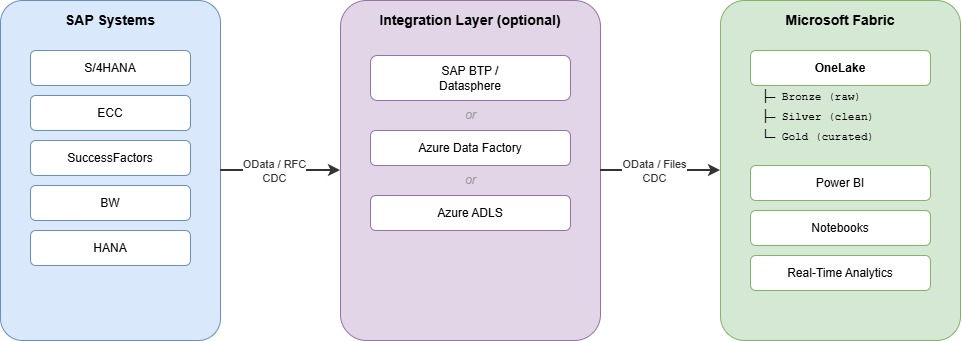

# Microsoft Fabric & SAP

> [!Important]
> When consuming SAP APIs and interfaces, always ensure your usage complies with [SAP's API Policy](https://help.sap.com/doc/sap-api-policy/latest/en-US/API_Policy_latest.pdf). Please check with your SAP contact or account team if you have questions about permitted API usage in your specific scenario.

Microsoft Fabric is a unified analytics platformthat brings together data engineering, data science, real-time analytics, and business intelligence into a single SaaS experience built on OneLake. For SAP customers, Fabric provides powerful options to extract, transform, and analyze SAP data — enabling modern analytics on top of SAP's operational systems.

> [!Important]
> Prior to implementing an SAP AI scenario review the SAP API Policy for usage guidelines and restrictions [SAP API Policy](https://help.sap.com/doc/sap-api-policy/latest/en-US/API_Policy_latest.pdf) documentation.

This page provides an overview of:
* What integration options are available?
* Why would you choose one option vs. another?
* How can you get started?

👉 **To get started, take a look at the [recommended integration patterns](#recommended-integration-patterns)**

## Why Fabric + SAP?

SAP systems contain some of the most valuable business data in an organization — financials, supply chain, procurement, HR, and more. Microsoft Fabric enables organizations to:

- **Consolidate SAP data** into OneLake alongside other data sources for unified analytics
- **Build modern dashboards and reports** on top of SAP operational data using Power BI (included in Fabric)
- **Enable data science & AI** on SAP data using Fabric's built-in notebooks and ML capabilities
- **Reduce data silos** by bringing SAP data into a governed, organization-wide data platform
- **Implement a Medallion architecture** (Bronze/Silver/Gold) with SAP as a key source system

## Key Scenarios & Use Cases

| Scenario | Description |
| --- | --- |
| **Financial Reporting** | Consolidate SAP FI/CO data with other financial systems for unified reporting |
| **Supply Chain Analytics** | Combine SAP MM/SD data with logistics and IoT data for end-to-end visibility |
| **HR Analytics** | Bring SAP SuccessFactors data into Fabric for workforce analytics and planning |
| **Procurement Spend Analysis** | Analyze SAP Ariba and S/4HANA procurement data alongside market data |
| **Real-time Operational Dashboards** | Stream SAP operational data into Fabric for near real-time KPI monitoring |
| **Data Lakehouse for SAP** | Build a governed data lakehouse with SAP as a primary source system |

## Data Integration Options

Fabric provides multiple ways to bring SAP data into OneLake. The right choice depends on your existing infrastructure, data volume, latency requirements, and available skills.

### Dataflows Gen2 (Power Query)

Dataflows Gen2 in Fabric use the Power Query engine and support a wide range of connectors, including:
- **SAP HANA** connector — connect directly to SAP HANA databases
- **SAP BW** connectors (Application Server, Message Server) — extract data from SAP BW cubes and queries
- **OData** connector — consume SAP OData services (S/4HANA, SuccessFactors, etc.)

Dataflows Gen2 are a good fit for **low-code, smaller-scale** data ingestion with transformation logic built visually.

### Data Pipelines

Data Pipelines in Fabric (based on Azure Data Factory) support dedicated SAP connectors for large-scale, scheduled data extraction:
- **SAP Table** connector — direct table-level extraction
- **SAP ODP (Operational Data Provisioning)** — extract from SAP extractors, CDS views, and ABAP objects
- **SAP HANA** connector — direct HANA access
- **SAP BW Open Hub** — extract from SAP BW via Open Hub Destinations
- **OData** connector — consume any OData service

Data Pipelines are the recommended approach for **enterprise-scale, production** data integration with SAP.

### Shortcuts & Mirroring

Fabric Shortcuts allow you to reference data stored externally (e.g. in Azure Data Lake Storage, S3, or Dataverse) without copying it. If your SAP data is already landing in one of these stores (e.g. via a prior ETL process), you can create a shortcut to make it available in OneLake instantly.

Fabric Mirroring provides near real-time replication for supported data sources. While SAP is not directly supported for mirroring today, data that has been landed in Azure SQL or Cosmos DB from SAP can be mirrored.

### SAP Datasphere Integration

SAP Datasphere and Microsoft Fabric can work together:
- **SAP Datasphere** can serve as a semantic/business layer on top of SAP data, and expose curated datasets
- These datasets can then be consumed in Fabric via OData or through an intermediate landing zone (e.g. Azure Data Lake Storage)
- This approach is especially valuable if your organization already uses SAP Datasphere for data modeling and governance

## Integration Protocols

| Protocol | Use Case | Connector in Fabric |
| --- | --- | --- |
| **OData** | Transactional APIs, SuccessFactors, S/4HANA Cloud | OData connector (Dataflows, Pipelines) |
| **RFC/BAPI** | Extraction from ECC/S/4HANA tables and BAPIs | SAP Table, SAP ODP connectors |
| **SQL / HANA** | Direct database access | SAP HANA connector |
| **Open Hub** | BW extraction via Open Hub Destinations | SAP BW Open Hub connector |
| **Files (CSV, Parquet)** | Pre-extracted data in a landing zone | File/ADLS connectors, Shortcuts |

## Architecture Overview

A typical Fabric + SAP architecture follows this pattern:

> 📥 [Download editable draw.io diagram](Fabric-SAP-Overview.drawio)

### Identity & Security

- **Service Principals / OAuth** — for scheduled pipeline-based extraction
- **SSO (Kerberos / SAML)** — for interactive access via Dataflows Gen2 or Power BI DirectQuery
- **On-premises Data Gateway** — required when SAP systems are behind a firewall and Fabric needs direct access
- **Private Endpoints** — for SAP systems running on Azure, network-level security via private endpoints and vnet integration

## Recommended Integration Patterns

The right pattern depends on your existing infrastructure and requirements:

| Scenario | Recommended Pattern |
| --- | --- |
| SAP data already in Azure Data Lake | Use [Shortcuts](#shortcuts--mirroring) to reference data directly in OneLake |
| Enterprise-scale extraction from SAP ECC/S/4HANA | Use [Data Pipelines with SAP ODP connectors](Architecture-DirectConnect.md) |
| SAP system behind a firewall, no Azure presence | Use [On-premises Data Gateway with Dataflows Gen2](Architecture-DirectConnect.md) |
| SAP BTP / Datasphere already in place | Use [SAP Datasphere as an intermediate layer](Architecture-BTP+Datasphere.md) |
| Existing Azure Data Factory pipelines | Use [ADF / Fabric Pipelines](Architecture-ADF+Pipeline.md) for seamless migration |
| Quick self-service analytics on SAP OData | Use Dataflows Gen2 with OData connector |

### Detailed Architecture Options

* [Direct SAP Connectors in Fabric (OData, Table, ODP, HANA)](Architecture-DirectConnect.md)
* [Via SAP BTP / Datasphere](Architecture-BTP+Datasphere.md)
* [Via Azure Data Factory / Fabric Pipelines](Architecture-ADF+Pipeline.md)

## Links & Resources

* [Microsoft Fabric Documentation](https://learn.microsoft.com/en-us/fabric/)
* [SAP Connectors in Data Pipelines](https://learn.microsoft.com/en-us/fabric/data-factory/connector-overview)
* [SAP HANA Connector in Dataflows](https://learn.microsoft.com/en-us/power-query/connectors/sap-hana/overview)
* [SAP BW Connectors in Power Query](https://learn.microsoft.com/en-us/power-query/connectors/sap-bw/application-setup-and-connect)
* [OneLake Shortcuts](https://learn.microsoft.com/en-us/fabric/onelake/onelake-shortcuts)
